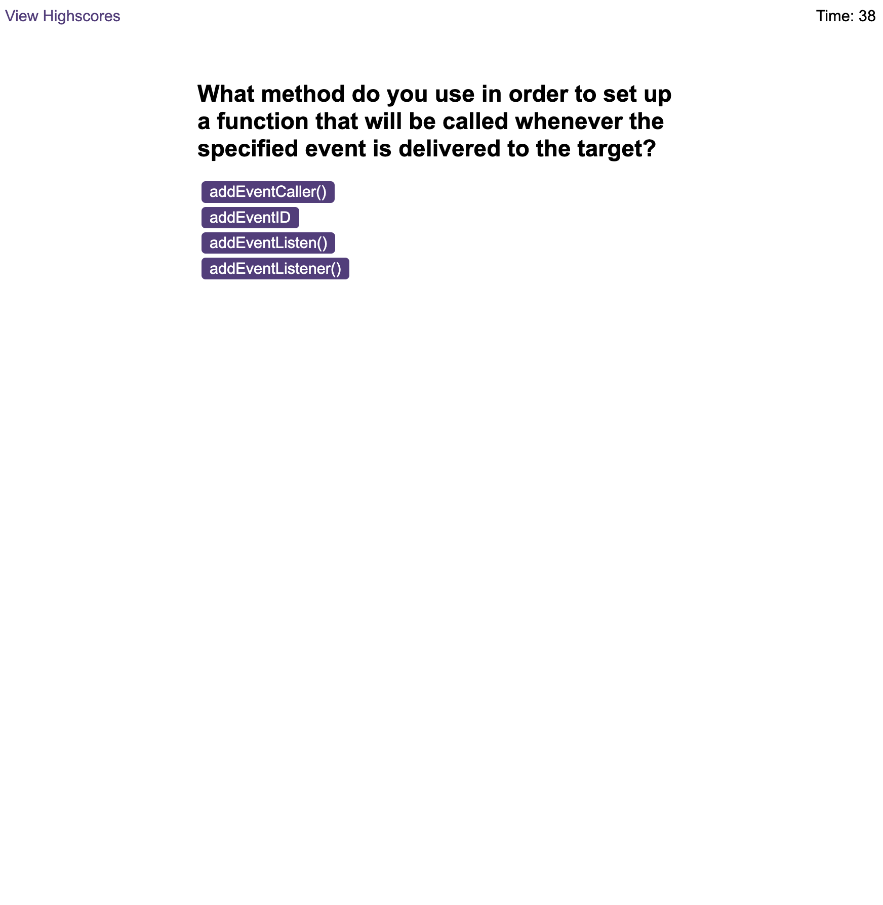

# code-quiz

## A code quiz that asks you questions about JavaScript, and presents you with your highscores at the end.

This project is a code quiz, in which you can race against the clock and compete for high scores.

## Installation

N/A

## Usage

Wesbite link:

To start the quiz, click on the "Start Quiz" button. Once clicked, you'll be presented with multiple choice questions, relating to JavaScript. If you choose a correct answer, ten points will be added to your score. If you choose an incorrect one, ten seconds will be deducted from your time. Upon completion (or time running out), you will be given the opportunity to log your initials and final score. This will then be accessible via the "view highscores" option.

## Credits

- https://github.com/HenryJamesGreen/weather-dashboard
- https://github.com/eliza-an/pokepod-pokemon-quiz
- https://github.com/HenryJamesGreen/daily-planner-app
- https://www.toptal.com/javascript/interview-questions
- https://www.w3schools.com/quiztest/quiztest.asp?qtest=JS
- https://www.guru99.com/javascript-interview-questions-answers.html

## License

Please refer to the licence in the repo.
